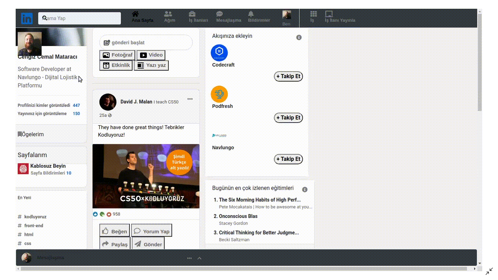
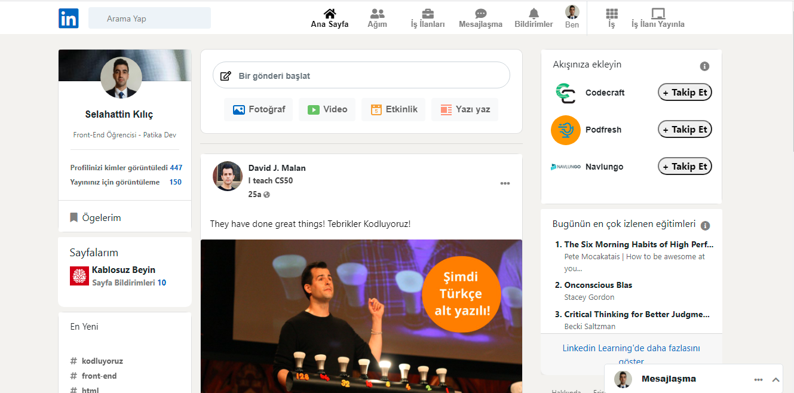

# Kodluyoruz front-end eğitimi kapsamında boostrap bölümünde bozuk olan bir linkedin sayfasını düzenlenmesi istenmiştir.Projenin ilk hali şu şekildedir.

# Yapılan düzenlemeler sonrasında şu şekli almıştır.
